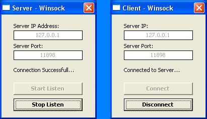



## Single Winsock Connection

### Description

* Single Winsock Program *

description: this little program contains Server and Client.

· Server - can start and stop listening for incoming connection...

· Client - connects to the listening Server with the specified Port, with Connect and Disconnect features...

this is my first submission to PSC, im a newbie in winsock and hope you may find it usefull and help you specially for beginners like me. i need comments, suggestions, questions or criticism about my little app... i dont expect your votes... thanx and God Bless... my credits goes to my friends Cris "Coding Genius" Waddell and Yariv Sarafraz for helping me learn about Winsock, thanx guys.
 
### More Info
 

             |
---                |---
**Submitted On**   |2002-08-25 22:26:00
**By**             |[Vanni Alora](https://github.com/Planet-Source-Code/PSCIndex/blob/master/ByAuthor/vanni-alora.md)
**Level**          |Beginner
**User Rating**    |4.7 (14 globes from 3 users)
**Compatibility**  |VB 5\.0, VB 6\.0
**Category**       |[Internet/ HTML](https://github.com/Planet-Source-Code/PSCIndex/blob/master/ByCategory/internet-html__1-34.md)
**World**          |[Visual Basic](https://github.com/Planet-Source-Code/PSCIndex/blob/master/ByWorld/visual-basic.md)
**Archive File**   |[Single\_Win1227298262002\.zip](https://github.com/Planet-Source-Code/vanni-alora-single-winsock-connection__1-38332/archive/master.zip)

